# ATELIER-01

## 1. Challenge 1

### 1.1 Démarrez la VM ubuntu

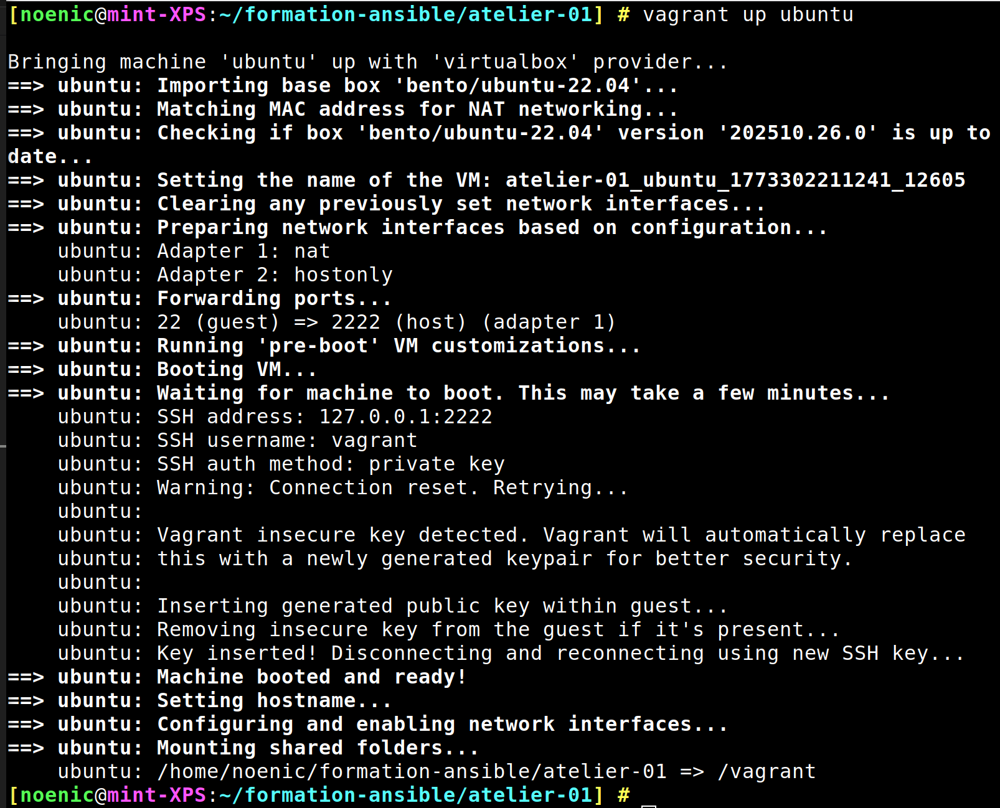
```bash
vagrant up ubuntu
```

### 1.2 Connectez-vous à la VM.

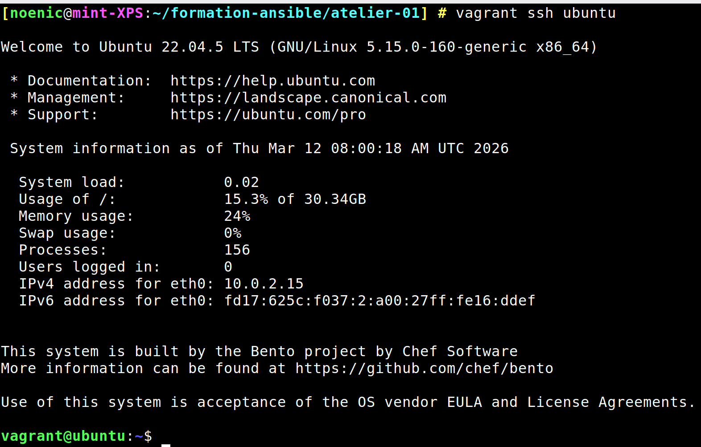
```bash
vagrant ssh ubuntu
```

### 1.3 Rafraîchissez les informations sur les paquets.
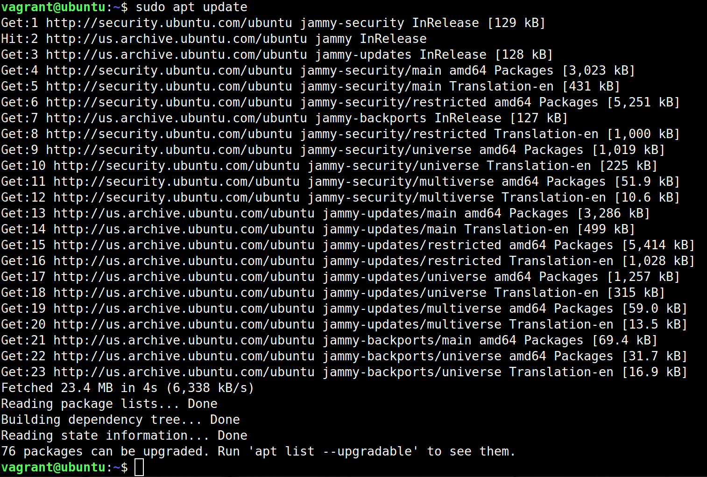
```bash
sudo apt update
```

### 1.4 Recherchez le paquet ansible.
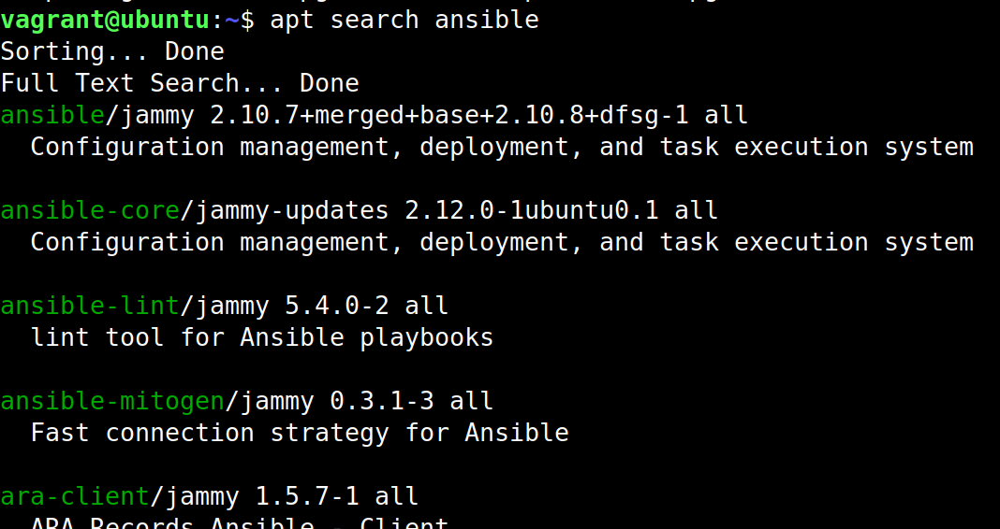
```bash
apt search ansible
```

### 1.5 Installez le paquet officiel fourni par la distribution.
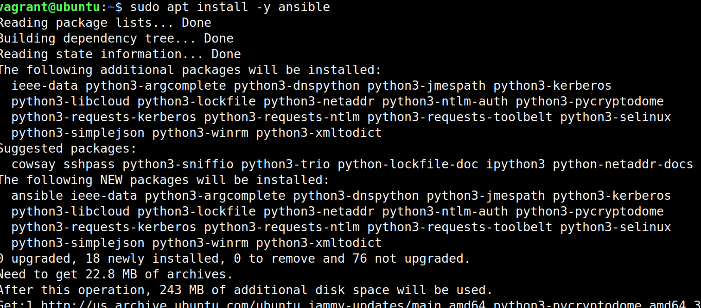
```bash
sudo apt install ansible
```
### 1.6  Notez la version d'Ansible.
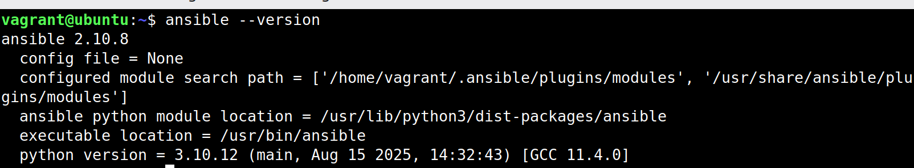
```bash
ansible --version
```

### 1.7 Déconnectez-vous et supprimez la VM.
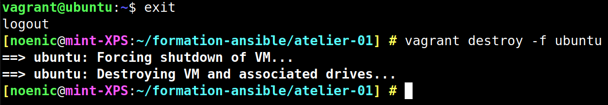
```bash
exit
vagrant destroy -f ubuntu
```


## 2. Challenge 2

### 2.1 Ajoutez le dépôt PPA pour Ansible.

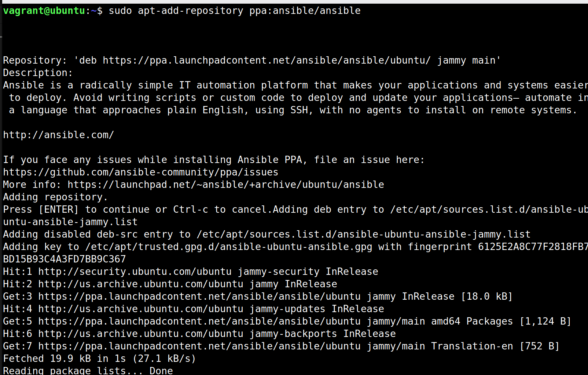
```bash
sudo apt-add-repository ppa:ansible/ansible
```

### 2.2 Installez Ansible depuis ce dépôt.
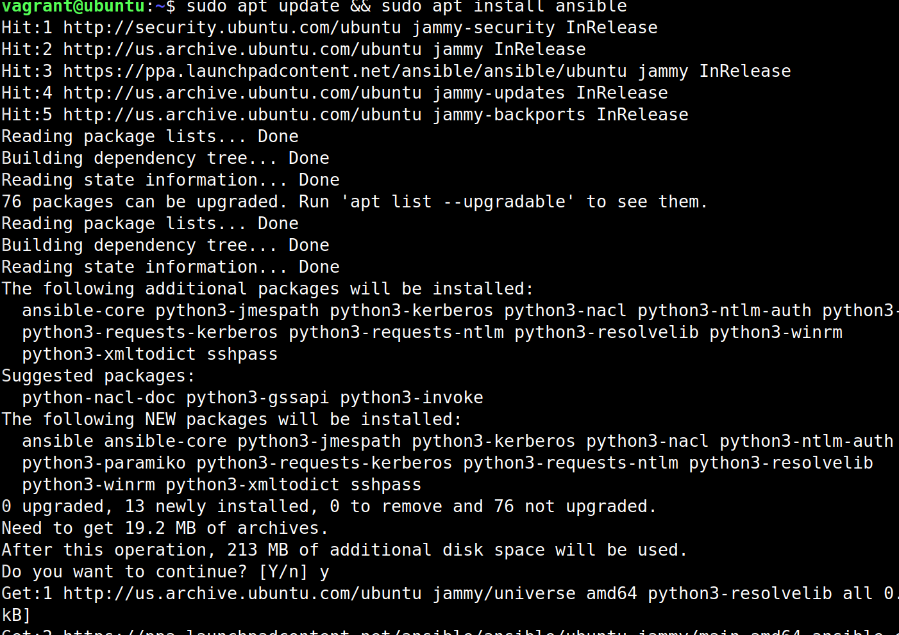
```bash
sudo apt update && sudo apt install ansible
```

### 2.3 Notez la version d'Ansible.
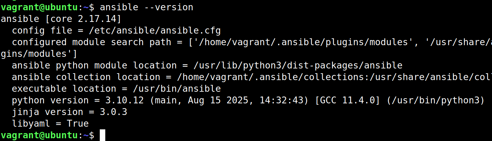
```bash
ansible --version
```

> On voit bien que la version d'Ansible est plus récente que celle fournie par la distribution, `2.10.8` et `2.17.14` respectivement.

## 3. Challenge 3

Lancez une VM Rocky Linux et installez Ansible en utilisant PIP et Virtualenv.

Rocky Linux et Virtualenv

Notez bien que contrairement à Debian, le paquet python3-venv n'est pas nécessaire ici, étant donné que Virtualenv fait partie des modules standard de Python dans cette distribution.

### 3.1 Démarrez la VM Rocky Linux.
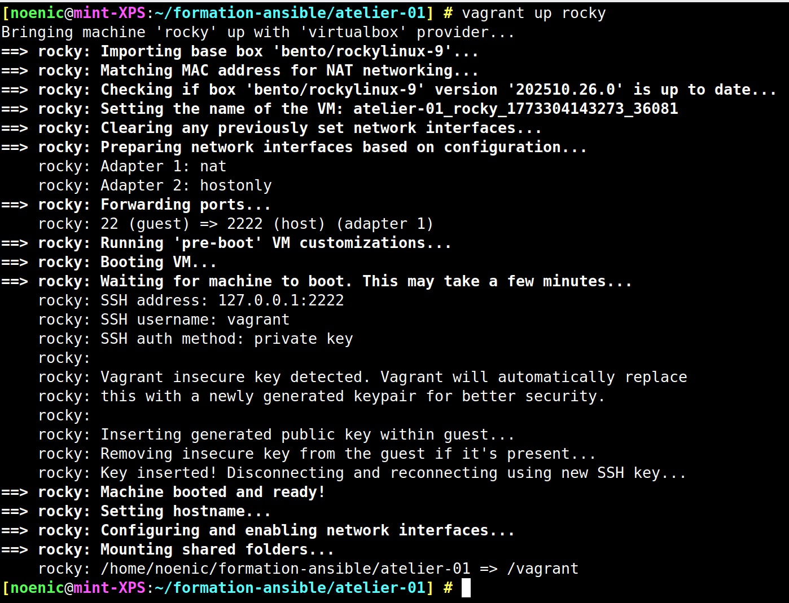
```bash
vagrant up rocky
```

### 3.2 Connectez-vous à la VM.
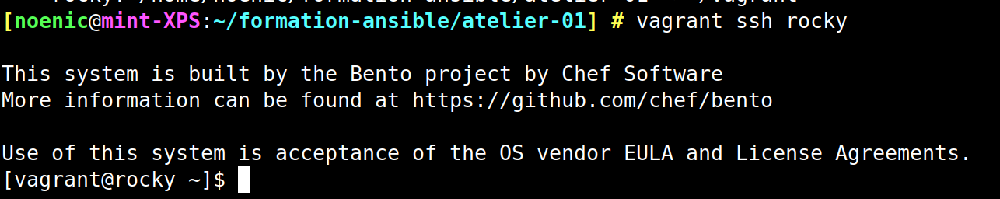
```
vagrant ssh rocky
```

### 3.3 Installez Python et les outils nécessaires.
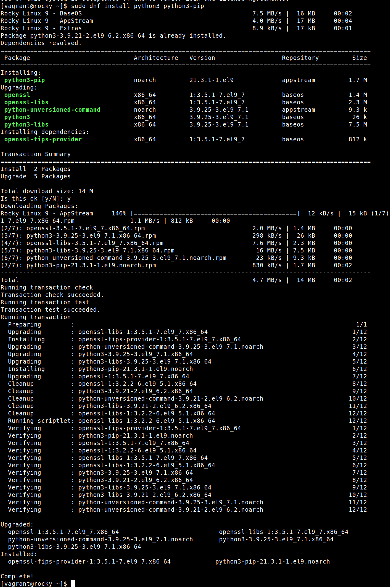
```bash
sudo dnf install python3 python3-pip
```

### 3.4 Créez un environnement virtuel et activez-le.
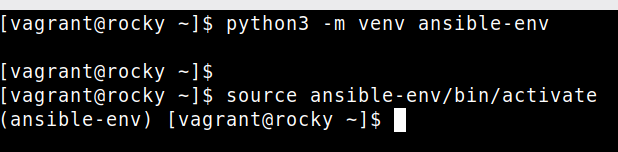
```bash
python3 -m venv ansible-env
source ansible-env/bin/activate
```

### 3.5 Installez Ansible dans l'environnement virtuel.
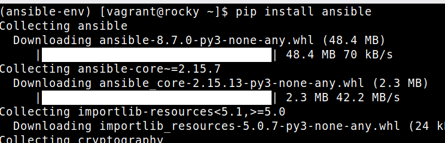
```bash
pip install ansible && ansible --version
```
### 3.6 Voir la version d'Ansible installée.
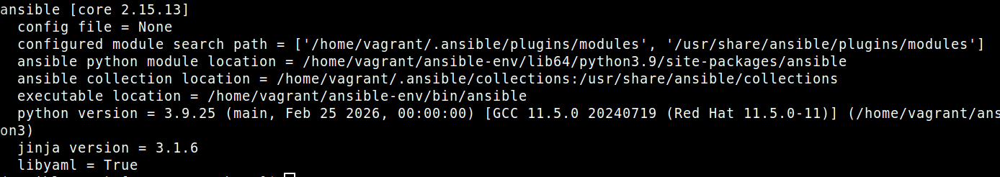
```bash
ansible --version
```


