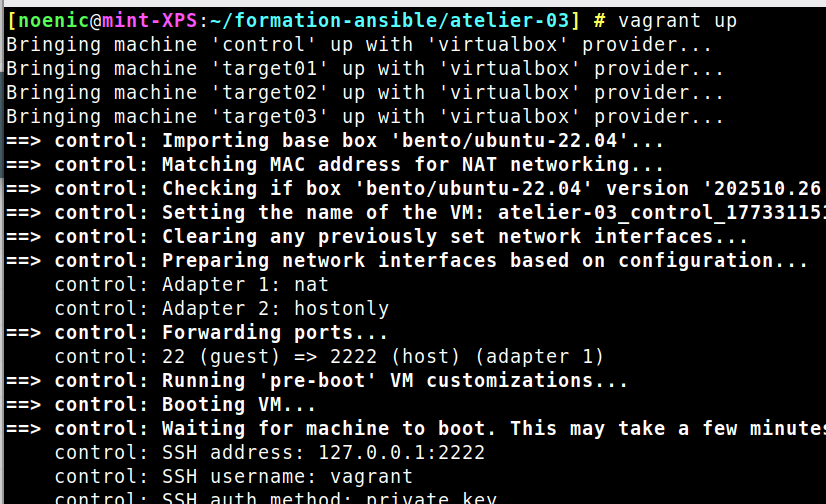
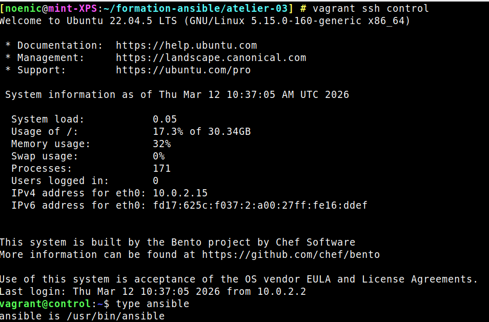
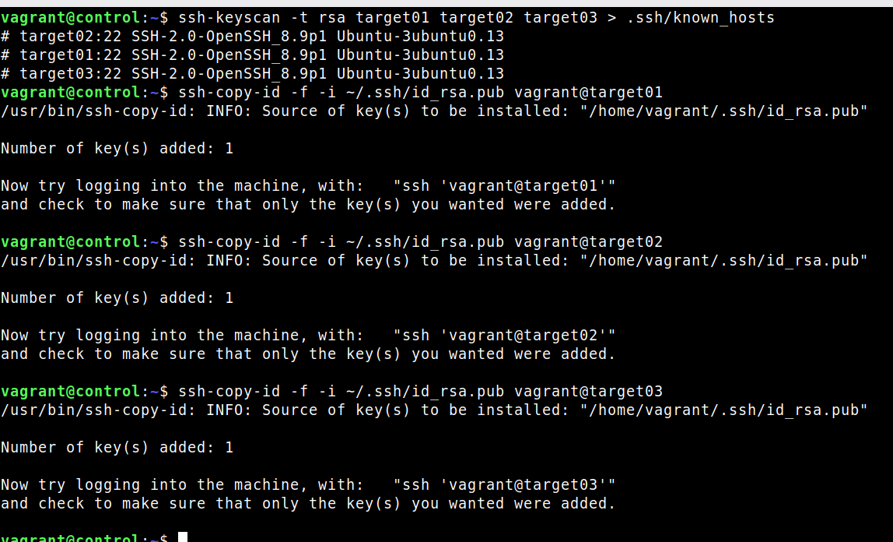
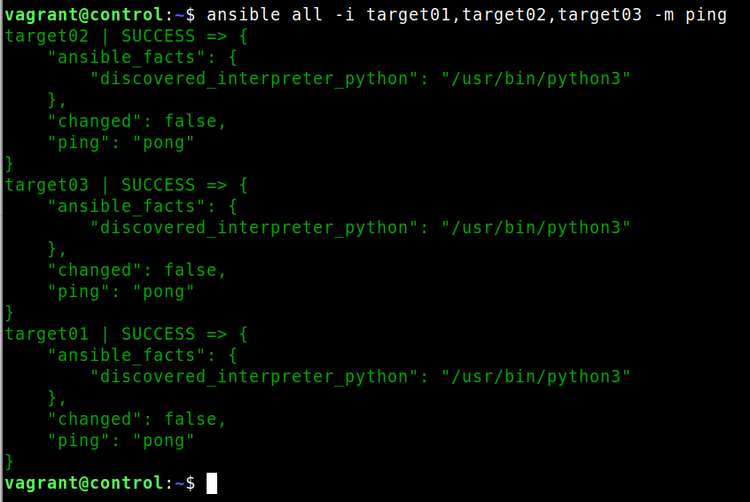

# ATELIER-03

### 1. Lancez les machines

```bash
vagrant up
```

### 2. Connectez-vous à la machine de contrôle

```bash
vagrant ssh control
type ansible
```

### 3. Ajoutez les targets à /etc/hosts

```conf title="Ajouter les targets à /etc/hosts"
127.0.0.1 localhost
127.0.1.1 vagrant

192.168.56.10   control
192.168.56.20	target01
192.168.56.30   target02
192.168.56.40   target03
```


### 4. Generez une paire de clés SSH sur la machine de contrôle

```bash
ssh-keygen -C "vagrant@control"
```

### 5. Ajoutez les clés SSH de control aux targets

```bash
ssh-copy-id -i ~/.ssh/id_rsa.pub vagrant@target01
ssh-copy-id -i ~/.ssh/id_rsa.pub vagrant@target02
ssh-copy-id -i ~/.ssh/id_rsa.pub vagrant@target03
```


### 6. Pinguez les targets depuis la machine de contrôle

```bash
ansible all -i target01,target02,target03 -m ping
```