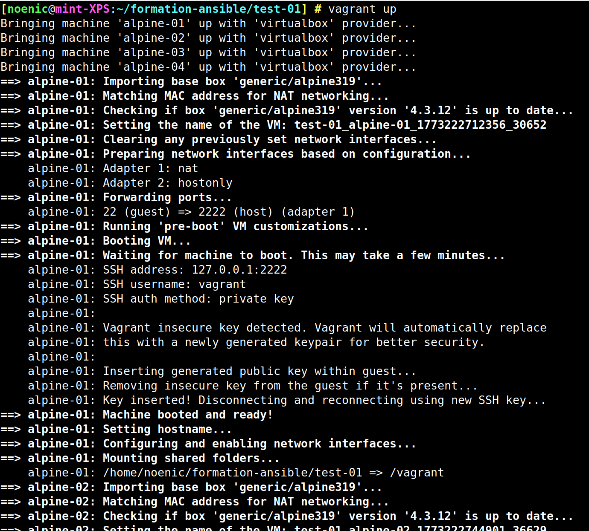
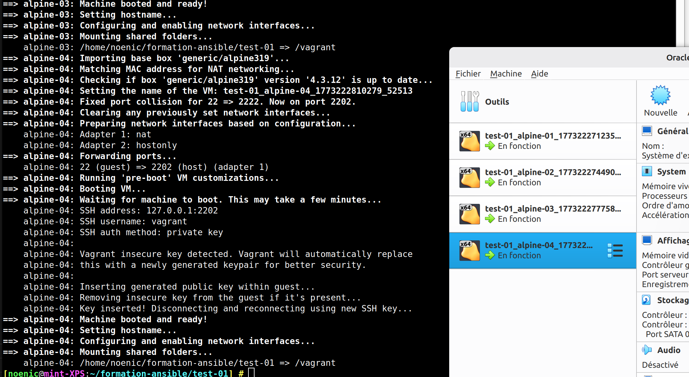
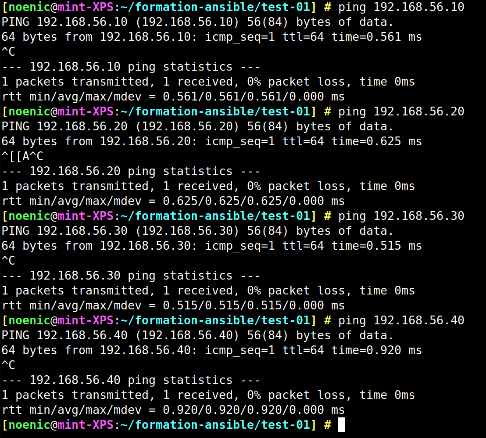
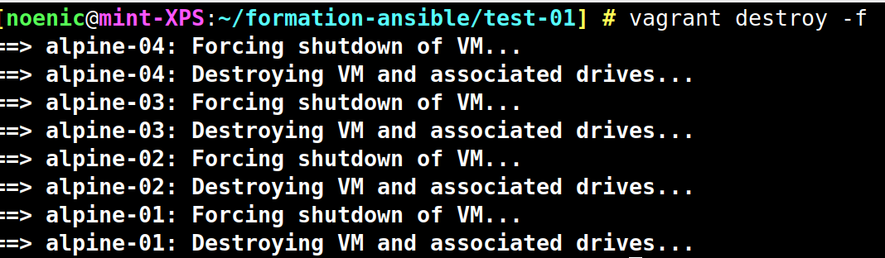

[🏠 Sommaire ](../README.md)
# TEST-01

## Le premier test pour s'assurer que tout fonctionne correctement.

Avec la commande  : 

```bash
vagrant box add generic/alpine319
```

On va lancer vagrant 


Vagrant commence à créer les machines virtuelles.


Elles sont visibles dans VirtualBox.


Et elles sont pingables.


On peut les supprimer