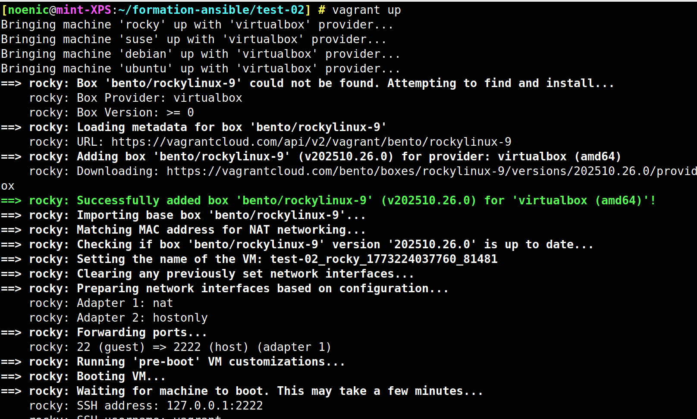
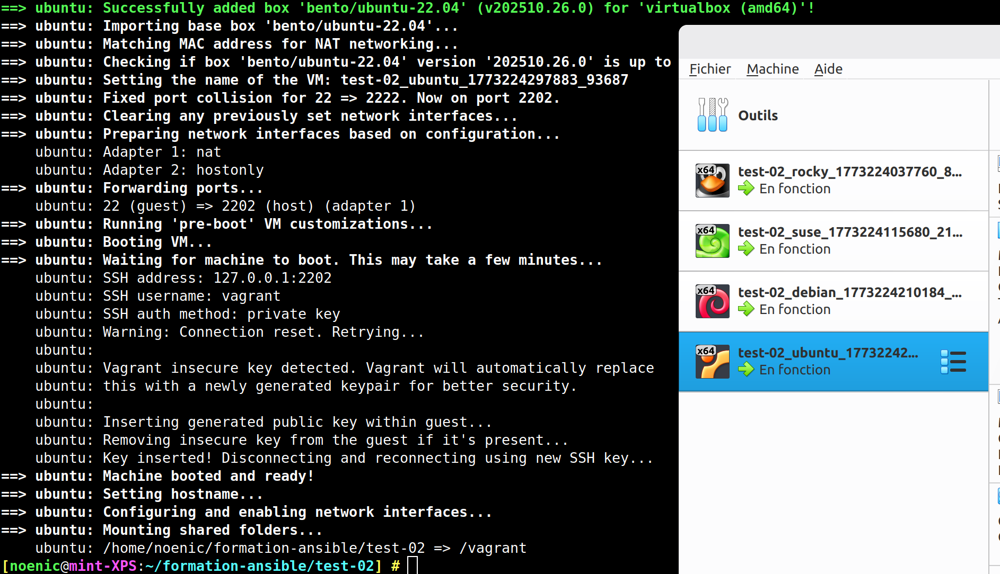
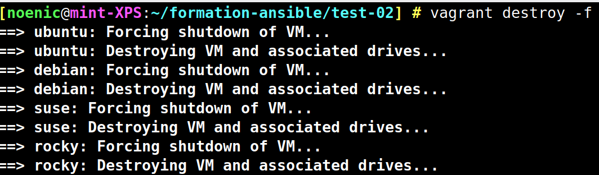

[🏠 Sommaire ](../README.md)
# TEST-02

## Le deuxième test pour s'assurer qu'on peut lancer plusieurs vm de flavors différents.

Avec la commande  : 

```bash
vagrant up
```



On telecharge les boxs.


Elles sont visibles dans VirtualBox.


On peut les supprimer


